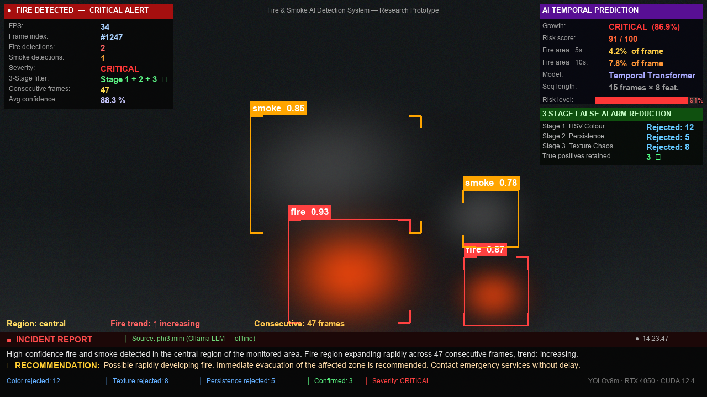

# Fire and Smoke Detection System

A real-time AI-powered fire and smoke detection system that goes beyond simple detection. It combines **YOLOv8m** object detection with a **Three-Stage False Alarm Reduction Framework**, a **Temporal Transformer** for fire progression prediction, and an **automated natural language incident reporting module** powered by a locally deployed LLM — all running in a single end-to-end pipeline on live video.

**Training status:** Complete (2026-09-14)

---

## Table of Contents

- [Overview](#overview)
- [Novel Contributions](#novel-contributions)
- [System Architecture](#system-architecture)
- [Performance Results](#performance-results)
- [Project Structure](#project-structure)
- [Requirements](#requirements)
- [Installation](#installation)
- [Usage](#usage)
- [Module 1 — YOLOv8m Detector](#module-1--yolov8m-detector)
- [Module 2 — Three-Stage False Alarm Reduction](#module-2--three-stage-false-alarm-reduction)
- [Module 3 — Temporal Transformer Fire Progression Prediction](#module-3--temporal-transformer-fire-progression-prediction)
- [Module 4 — Automated NLG Incident Reporter](#module-4--automated-nlg-incident-reporter)
- [Training](#training)
- [Output and Annotations](#output-and-annotations)
- [Severity Scoring](#severity-scoring)
- [Using as a Library](#using-as-a-library)
- [Source Files Reference](#source-files-reference)
- [Environment Variables](#environment-variables)
- [Troubleshooting](#troubleshooting)

---

## Overview

Most existing fire detection systems only answer one question: **"Is fire present?"**. This system answers four:

1. **Is fire or smoke present?** — YOLOv8m detector
2. **Is this a real detection or a false alarm?** — Three-stage verification
3. **How will this fire develop in the next 5–10 seconds?** — Temporal Transformer
4. **What should responders be told?** — LLM incident report

The pipeline is designed for real-time deployment on surveillance cameras, with all modules running simultaneously on a single GPU.

---

## Novel Contributions

### Contribution 1 — Three-Stage False Alarm Reduction Framework

The single biggest source of failure in camera-based fire detection systems is false alarms — detections triggered by sunsets, vehicle tail lights, reflections, construction dust, and camera flashes. This system introduces a three-stage post-detection verification pipeline that rejects false positives **without reducing true positive sensitivity**:

- **Stage 1:** HSV color space verification — checks that detected pixels match the known spectral signature of fire (red-orange-yellow hues) or smoke (low-saturation grey)
- **Stage 2:** Temporal persistence filter — confirms detection persists across multiple frames, rejecting single-frame spurious detections from flashes or transient reflections
- **Stage 3:** Laplacian texture chaos analysis — verifies that the detected region has the chaotic, high-frequency texture characteristic of fire/smoke rather than the smooth texture of false-alarm objects

This combination has not previously been applied as a unified post-YOLO verification framework.

### Contribution 2 — Temporal Transformer for Fire Progression Prediction

Existing systems treat every frame independently. This system accumulates a **15-frame sliding window** of structured fire detection features and feeds them into a **Temporal Transformer** that predicts:

- **Growth classification:** stable / growing / critical
- **Risk score:** 0–100 continuous severity
- **Predicted fire area at +5 seconds** and **+10 seconds**

The model is trained using **self-supervised labeling** — labels are automatically derived from fire area growth rate across unlabeled fire videos, requiring no manual annotation.

### Contribution 3 — LLM-Powered Natural Language Incident Reporting

The system converts structured detection metadata into human-readable incident descriptions and safety recommendations using a **locally deployed LLM (Ollama/Phi-3 Mini)**. This runs entirely offline with no API key required. If the LLM is unavailable, a rule-based NLG fallback activates automatically. Reports refresh every 30 frames without blocking the video pipeline.

---

## System Architecture

Every video frame passes through all four modules in sequence:

```
VIDEO FRAME
    |
    v
+----------------------------------+
|  MODULE 1: YOLOv8m DETECTOR      |
|                                  |
|  - Anchor-free detection         |
|  - 640x640 input resolution      |
|  - 2 classes: smoke(0), fire(1)  |
|  - Outputs raw bounding boxes    |
|    with confidence scores        |
+----------------+-----------------+
                 | raw detections
                 v
+----------------------------------+
|  MODULE 2: THREE-STAGE FALSE     |
|  ALARM REDUCTION                 |
|                                  |
|  Stage 1: HSV Color Check        |
|    fire  -> hue 0-35 or 160-180  |
|    smoke -> low saturation       |
|                                  |
|  Stage 2: Temporal Persistence   |
|    IoU > 0.10 with previous      |
|    W=3 frames required           |
|                                  |
|  Stage 3: Laplacian Texture      |
|    fire  -> variance > 200       |
|    smoke -> variance > 80        |
+----------------+-----------------+
                 | verified detections
                 v
+----------------------------------+
|  MODULE 3: TEMPORAL TRANSFORMER  |
|                                  |
|  Input: 15 frames x 8 features   |
|  -> Linear(8->64)                |
|  -> Positional Encoding          |
|  -> TransformerEncoder           |
|     (3 layers, 4 heads, ff=256)  |
|  -> Mean pooling                 |
|  -> 4 output heads:              |
|     growth (stable/grow/crit)    |
|     risk score (0-100)           |
|     area at +5s                  |
|     area at +10s                 |
+----------------+-----------------+
                 | prediction
                 v
+----------------------------------+
|  MODULE 4: NLG INCIDENT REPORTER |
|                                  |
|  - Spatial region mapping (3x3)  |
|  - Fire area trend analysis      |
|  - Consecutive frame counter     |
|  - Ollama LLM (primary)          |
|  - Rule-based NLG (fallback)     |
|  - Non-blocking background thread|
+----------------+-----------------+
                 |
                 v
   ANNOTATED FRAME WITH ALL OVERLAYS
```

For complete pseudocode covering all 14 algorithms in the system, see [ALGORITHM.md](ALGORITHM.md).

---

## Performance Results

### YOLOv8m Detection Results

Trained on D-Fire dataset (14,122 train / 3,099 val). Evaluated on the validation set after 50 epochs.

| Metric | Overall | Fire | Smoke |
|--------|---------|------|-------|
| mAP@0.5 | **77.7%** | 72.2% | 83.3% |
| mAP@0.5:0.95 | **46.6%** | — | — |
| Precision | **78.6%** | — | — |
| Recall | **70.8%** | — | — |
| Inference latency | **5.6 ms** | — | — |
| End-to-end FPS | **34** | — | — |

Key observation: smoke outperformed fire (83.3% vs 72.2% mAP@0.5), likely because smoke occupies larger image regions and produces more training signal per image than concentrated fire pixels.

### Temporal Transformer Results

Trained on 52 fire videos (FIRESENSE dataset: 49 AVI + UniDataPro: 3 MP4). 347,436 sequences after x5 Gaussian noise augmentation.

| Metric | Value |
|--------|-------|
| Training accuracy | 93.5% |
| Validation accuracy | **90.0%** |
| Validation loss | 17.85 |
| Total sequences | 347,436 |
| Training videos | 52 |
| Model parameters | 159,174 |
| Epochs trained | 50 |

### System Demo



*Figure: End-to-end system output on a fire video — showing bounding boxes (red=fire, orange=smoke), HUD overlay, Temporal Transformer prediction panel, false alarm filter counters, and the incident report bar with LLM/rule-based description and severity-colored recommendation.*

---

## Project Structure

```
fire-smoke-detection/
|
+-- src/
|   +-- __init__.py            # Exports all public classes
|   +-- detector.py            # YOLOv8m loading, inference, Stage 1 + Stage 3
|   +-- pipeline.py            # Master pipeline: Stage 2 + all module coordination
|   +-- tracker.py             # 8-feature per-frame extractor + 15-frame sliding window
|   +-- predictor.py           # Temporal Transformer architecture + inference wrapper
|   +-- reporter.py            # NLG reporter: Ollama LLM + rule-based fallback
|   +-- download_weights.py    # Auto-download weights from Hugging Face
|   +-- weights/               # Created automatically on first run
|       +-- fire_detection_yolov8m.pt   # YOLOv8m detector weights (49.6 MB, trained)
|       +-- fire_predictor.pt           # Temporal Transformer weights (trained)
|
+-- train_yolov8m_local.py     # YOLOv8m training script for local GPU (RTX 4050 / ~6 GB VRAM)
+-- train_predictor.py         # Temporal Transformer training on fire video dataset
+-- run.py                     # CLI entry point (image / video / webcam) with live preview
+-- requirements.txt           # Python dependencies
+-- README.md
+-- ALGORITHM.md               # 14 formal pseudocode algorithms for all system modules
+-- report.md                  # Detailed research article helper with actual results
+-- system_output_demo.png     # Demo image for research article (1280x720, 300 DPI)
```

---

## Requirements

| Requirement | Minimum | Recommended |
|-------------|---------|-------------|
| Python | 3.9 | 3.10+ |
| RAM | 8 GB | 16 GB |
| GPU VRAM | 4 GB | 6 GB+ |
| Disk space | 3 GB | 10 GB (with datasets) |
| CUDA | 11.8 | 12.4+ |
| OS | Windows 10 / Linux | Windows 11 / Ubuntu 22.04 |

**Python packages** (installed via `requirements.txt`):

| Package | Version | Purpose |
|---------|---------|---------|
| `ultralytics` | 8.x | YOLOv8m training and inference |
| `torch` | 2.6.0+cu124 | PyTorch deep learning backend |
| `torchvision` | 0.21.0 | Vision utilities |
| `opencv-python` | 4.x | Frame I/O, color conversion, annotation |
| `numpy` | 1.26.4 | Array operations |
| `requests` | latest | Model weight download |
| `pyyaml` | latest | Dataset config generation |

**Optional:**
- [Ollama](https://ollama.com) — local LLM server for AI-powered incident reports
- `phi3:mini` or `llama3.2:3b` — LLM model (pulled via Ollama)

---

## Installation

**Step 1 — Clone and create virtual environment:**

```bash
git clone <repo-url>
cd fire-smoke-detection

python -m venv .venv

# Windows
.\.venv\Scripts\activate

# macOS / Linux
source .venv/bin/activate
```

**Step 2 — Install dependencies:**

```bash
pip install -r requirements.txt
```

**Step 3 — Install PyTorch with CUDA (strongly recommended for real-time use):**

```bash
# CUDA 12.4
pip install torch torchvision torchaudio --index-url https://download.pytorch.org/whl/cu124

# If C drive is full, redirect pip cache to another drive
pip install torch torchvision torchaudio --index-url https://download.pytorch.org/whl/cu124 --cache-dir "D:\pip_cache"
```

Verify GPU is detected:

```bash
python -c "import torch; print('CUDA:', torch.cuda.is_available()); print('GPU:', torch.cuda.get_device_name(0))"
```

**Step 4 — Model weights (automatic):**

Weights download automatically on first run from Hugging Face. To download manually:

```bash
python -m src.download_weights
```

Weights are saved to `src/weights/fire_detection_yolov8m.pt`.

**Step 5 — (Optional) Install Ollama for LLM incident reports:**

Download and install from [ollama.com](https://ollama.com), then:

```bash
ollama pull phi3:mini       # 2.2 GB -- recommended
# or
ollama pull llama3.2:3b     # 2.0 GB -- alternative
```

The system auto-detects Ollama at startup and falls back to rule-based NLG silently if unavailable.

---

## Usage

### Run on an image

```bash
python run.py --source path/to/image.jpg --output result.jpg
```

### Run on a video file

```bash
python run.py --source path/to/video.mp4 --output result.mp4
```

Supported formats: `.mp4`, `.avi`, `.mov`, `.mkv`

A live preview window (1280x720, aspect-ratio-preserving) opens during video processing. Press `q` to stop early.

### Run on live webcam

```bash
python run.py --source webcam --device cuda
```

Press `q` to quit.

### CLI flags

| Flag | Type | Default | Description |
|------|------|---------|-------------|
| `--source` | `str` | required | File path or `webcam` |
| `--output` | `str` | `output.jpg` | Output file path |
| `--conf` | `float` | `0.25` | YOLO confidence threshold (0.0-1.0) |
| `--device` | `str` | `cpu` | `cpu`, `cuda`, or GPU index (e.g. `0`) |

**Examples:**

```bash
# GPU inference, high confidence
python run.py --source fire_video.mp4 --output out.mp4 --conf 0.4 --device cuda

# Webcam on GPU
python run.py --source webcam --device cuda

# CPU only
python run.py --source image.jpg --output result.jpg --device cpu
```

---

## Module 1 — YOLOv8m Detector

**File:** `src/detector.py` | **Class:** `FireDetector`

### Architecture

YOLOv8m (medium) is chosen as the primary detector. It is an anchor-free, single-stage object detector with:

| Property | Value |
|----------|-------|
| Architecture variant | YOLOv8m |
| depth_multiple | 0.67 |
| width_multiple | 0.75 |
| Total parameters | 25,857,478 |
| Backbone | CSP-Darknet with C2f (Cross Stage Partial with 2 convolutions) modules |
| Neck | PANet (Path Aggregation Network) FPN |
| Head | Decoupled detection head (separate cls/reg branches) |
| Input size | 640 x 640 pixels |
| Detection classes | 2 -- smoke (class 0), fire (class 1) |
| Confidence threshold | 0.25 (configurable) |
| IoU threshold | 0.45 (NMS) |

### Why YOLOv8m over YOLOv8n/s/l?

- **YOLOv8n** (nano, 3M params) — too small, lower accuracy on small smoke regions
- **YOLOv8s** (small, 11M params) — acceptable but lower mAP than medium
- **YOLOv8m** (medium, 25M params) — best accuracy/speed tradeoff for real-time 6 GB VRAM inference
- **YOLOv8l/x** (large, 43M+ params) — too heavy for 6 GB VRAM at batch inference

### Training Dataset — D-Fire

| Property | Value |
|----------|-------|
| Dataset name | D-Fire |
| Source | Kaggle: `sayedgamal99/smoke-fire-detection-yolo` |
| Format | YOLO format (txt labels) |
| Classes | smoke (0), fire (1) |
| Train images | 14,122 |
| Val images | 3,099 |
| Total images | 17,221 |

### Training Hyperparameters

| Hyperparameter | Value | Reason |
|---------------|-------|--------|
| Epochs | 50 | Sufficient convergence with early stopping |
| Batch size | 4 | RTX 4050 Laptop GPU reports 5.996 GB VRAM (not exactly 6 GB) |
| Image size | 640 | Standard YOLO input, good detail/speed balance |
| Optimizer | SGD (auto) | Better generalization than Adam for YOLO |
| lr0 | 0.01 | Standard YOLO learning rate |
| lrf | 0.01 | Final LR = lr0 x lrf |
| Momentum | 0.937 | Standard YOLO momentum |
| Weight decay | 0.0005 | Regularization |
| Warmup epochs | 3 | Gradual LR ramp-up |
| AMP | True | Mixed precision -- halves VRAM usage |
| Early stopping patience | 15 | Stop if no improvement for 15 epochs |
| Mosaic augmentation | 1.0 | Combines 4 images -- improves small object detection |
| Close mosaic | 10 | Disable mosaic for final 10 epochs |
| HSV-H | 0.015 | Hue jitter |
| HSV-S | 0.7 | Saturation jitter |
| HSV-V | 0.4 | Brightness jitter |
| Horizontal flip | 0.5 | Standard augmentation |
| Scale | 0.5 | Random scale augmentation |
| Random erasing | 0.4 | Occlusion robustness |
| Pretrained | COCO | Transfer learning from COCO backbone |
| DataLoader workers | 2 | Windows multiprocessing stability |

### Trained Results

| Metric | Overall | Fire (class 1) | Smoke (class 0) |
|--------|---------|----------------|-----------------|
| mAP@0.5 | 77.7% | 72.2% | 83.3% |
| mAP@0.5:0.95 | 46.6% | -- | -- |
| Precision | 78.6% | -- | -- |
| Recall | 70.8% | -- | -- |
| Inference latency | 5.6 ms | -- | -- |
| End-to-end FPS | 34 | -- | -- |

### Inference

```python
from src.detector import FireDetector, Detection

detector = FireDetector(
    conf_threshold=0.25,
    iou_threshold=0.45,
    device="cuda",
    enable_verification=True,   # enables Stage 1 + Stage 3
)

detections = detector.detect(frame)   # returns List[Detection]

# Each Detection:
# .bbox         : [x1, y1, x2, y2]
# .confidence   : float (0.0 - 1.0)
# .class_id     : int (0=smoke, 1=fire)
# .label        : str ("smoke" or "fire")
# .crop         : np.ndarray (cropped region from frame)
```

### Model Weight Loading

On initialization, `FireDetector` checks `src/weights/fire_detection_yolov8m.pt`. If missing, it downloads automatically from Hugging Face using the URL in `FIRE_MODEL_HF_URL` env variable. The trained weight file is 49.6 MB (YOLOv8m architecture).

---

## Module 2 — Three-Stage False Alarm Reduction

**Files:** `src/detector.py` (Stage 1 + 3), `src/pipeline.py` (Stage 2)

This is the first novel contribution. Three independent verification checks are applied to every raw YOLO detection before it is accepted. All three stages must pass. Any single failure rejects the detection.

### Stage 1 — HSV Color Space Verification

**Where:** `detector.py` -> `_verify_color(crop, label)`

**Motivation:** Real fire emits light in a narrow spectral range. In HSV color space, fire occupies hue 0-35 degrees (red-orange-yellow) and wraparound 160-180 degrees (deep red), with high saturation and brightness. Smoke appears as achromatic grey with very low saturation. Many false alarm sources (sunsets, brake lights, orange safety vests) fail this test.

**Algorithm:**

For fire detections:
```
Convert BGR crop to HSV

mask_1 = pixels where:
    H in [0, 35]    (red-orange-yellow hues)
    S in [100, 255]  (high saturation)
    V in [100, 255]  (high brightness)

mask_2 = pixels where:
    H in [160, 180]  (deep red wraparound)
    S in [100, 255]
    V in [100, 255]

combined_mask = mask_1 OR mask_2
pixel_ratio = count_nonzero(combined_mask) / total_pixels

ACCEPT if pixel_ratio > 0.12  (at least 12% of crop is fire-colored)
REJECT otherwise
```

For smoke detections:
```
Convert BGR crop to HSV

mask = pixels where:
    H in [0, 180]    (any hue -- smoke is achromatic)
    S in [0, 60]     (very low saturation -- grey/white)
    V in [80, 220]   (medium brightness -- not too dark, not pure white)

pixel_ratio = count_nonzero(mask) / total_pixels

ACCEPT if pixel_ratio > 0.10  (at least 10% of crop is smoke-colored)
REJECT otherwise
```

**What it rejects:** Sunsets (wrong hue for fire), vehicle tail lights (too uniform saturation), orange road barriers (correct hue but wrong texture -- caught by Stage 3), white walls (too high brightness for smoke).

**Rejection counter:** `detector.color_rejected` increments per rejection, reported in `get_stats()`.

---

### Stage 2 — Temporal Persistence Filter

**Where:** `pipeline.py` -> `_filter_by_persistence(detections)`

**Motivation:** Real fire and smoke persist across many consecutive frames. Single-frame false detections from camera flashes, sudden light reflections, or compression artifacts appear in only 1-2 frames and then vanish. This stage exploits temporal continuity as a verification signal.

**Algorithm:**

```
Maintain a sliding window history of the last W=3 frames.
Each entry stores the list of accepted bounding boxes from that frame.

For each new detection box_t at frame t:

    is_persistent = False
    For each past frame k in {t-1, t-2, t-3}:
        For each past_box in history[k]:
            IoU(box_t, past_box) > 0.10 ?
                -> is_persistent = True, break

    if is_persistent:
        ACCEPT detection
    else:
        REJECT detection (persistence_rejected counter increments)

Grace period: if fewer than W-1 frames have been processed,
accept all detections (avoids missing the first frames of a real fire).
```

**IoU calculation:**
```
intersection = max(0, min(x2_a, x2_b) - max(x1_a, x1_b))
             * max(0, min(y2_a, y2_b) - max(y1_a, y1_b))

union = area_a + area_b - intersection

IoU = intersection / union
```

**Threshold choice:** IoU > 0.10 is intentionally loose -- fire moves and grows, so exact overlap is not expected. We only require spatial proximity, not exact match.

**What it rejects:** Camera flashes (1 frame), passing reflections (1-2 frames), transient smoke from passing vehicles.

---

### Stage 3 — Laplacian Texture Chaos Analysis

**Where:** `detector.py` -> `_verify_texture(crop, label)`

**Motivation:** Fire and smoke have extremely chaotic, irregular textures with high spatial frequency variation. Static false-alarm objects (painted walls, traffic signs, uniform lights) have smooth, low-variance textures. The Laplacian operator measures second-order spatial derivatives -- a proxy for texture complexity.

**Algorithm:**

```
Convert BGR crop to grayscale

Apply Laplacian operator:
    L(x, y) = d^2 I/dx^2 + d^2 I/dy^2
    (implemented as cv2.Laplacian with CV_64F depth)

texture_score = variance of all Laplacian values

Fire:  ACCEPT if texture_score > 200.0
Smoke: ACCEPT if texture_score > 80.0
       (Smoke threshold lower because smoke is more diffuse)
```

**Why different thresholds?** Fire produces rapidly flickering, high-contrast pixel patterns (flame edges, bright cores) that score very high on Laplacian variance. Smoke is more diffuse and uniform in texture, but still significantly more chaotic than solid objects.

**What it rejects:** Red painted walls (low variance), traffic signs (uniform surface), indicator LEDs (solid colored pixels), white sunlit building surfaces.

---

### Combined Statistics

All three counters are accessible via `pipeline.get_stats()["verification"]`:

```python
{
    "enabled": True,
    "color_rejected": 12,        # Stage 1 rejections
    "texture_rejected": 4,       # Stage 3 rejections
    "persistence_rejected": 8,   # Stage 2 rejections
    "total_rejected": 24,        # sum of all three
    "persistence_window": 3,
}
```

---

## Module 3 — Temporal Transformer Fire Progression Prediction

**File:** `src/predictor.py` | **Class:** `FireProgressionPredictor`
**Feature extractor:** `src/tracker.py` | **Class:** `FireFeatureTracker`

This is the second novel contribution. Instead of treating each frame independently, the system accumulates a 15-frame history of structured detection features and uses a Transformer to model temporal dynamics and predict future fire behavior.

### Feature Extraction — FireFeatureTracker

Every frame, 8 numerical features are extracted from the current detections and appended to a sliding window. Once the window reaches 15 frames, it is passed to the Temporal Transformer.

**8-dimensional feature vector per frame:**

| Index | Feature | Computation | Range |
|-------|---------|-------------|-------|
| 0 | `fire_area` | Sum(width x height) of fire bboxes / frame_area | [0, 1] |
| 1 | `smoke_area` | Sum(width x height) of smoke bboxes / frame_area | [0, 1] |
| 2 | `fire_count` | Number of fire detections in frame | [0, N] |
| 3 | `smoke_count` | Number of smoke detections in frame | [0, N] |
| 4 | `avg_confidence` | Mean confidence of all detections (0 if none) | [0, 1] |
| 5 | `growth_rate` | fire_area_t minus fire_area_{t-1} | [-1, 1] |
| 6 | `centroid_x` | Mean fire bbox center X / frame width (0 if no fire) | [0, 1] |
| 7 | `centroid_y` | Mean fire bbox center Y / frame height (0 if no fire) | [0, 1] |

All area features are normalized by frame area so the model is resolution-independent.

**Sliding window:** The tracker stores the last 15 feature vectors. Once full, `update()` returns the complete sequence as `List[List[float]]` (shape 15x8). On earlier frames it returns `None`.

### Temporal Transformer Architecture

**Total parameters: 159,174** (lightweight, designed for real-time inference alongside YOLO)

```
Input tensor: (batch_size, T=15, F=8)
                    |
                    v
        +------------------------+
        |  Linear Projection     |
        |  Linear(8 -> 64)       |
        |  Output: (B, 15, 64)   |
        +------------------------+
                    |
                    v
        +------------------------+
        |  Sinusoidal Positional |
        |  Encoding              |
        |  pe[pos, 2i]   = sin(pos / 10000^(2i/64)) |
        |  pe[pos, 2i+1] = cos(pos / 10000^(2i/64)) |
        |  + Dropout(0.1)        |
        +------------------------+
                    |
                    v
        +------------------------+
        |  TransformerEncoder    |
        |  3 layers              |
        |  4 attention heads     |
        |  d_model = 64          |
        |  dim_feedforward = 256 |
        |  dropout = 0.1         |
        |  batch_first = True    |
        +------------------------+
                    |
                    v
        +------------------------+
        |  LayerNorm(64)         |
        +------------------------+
                    |
                    v
        +------------------------+
        |  Mean pooling          |
        |  over T=15 timesteps   |
        |  Output: (B, 64)       |
        +------------------------+
                    |
        +-----------+------------+-----------+
        |           |            |           |
        v           v            v           v
  growth_head   risk_head   area_5s_head  area_10s_head
  Linear(64,32) Linear(64,32) Linear(64,32) Linear(64,32)
  ReLU          ReLU          ReLU          ReLU
  Linear(32,3)  Linear(32,1)  Linear(32,1)  Linear(32,1)
                Sigmoid*100   ReLU          ReLU
        |           |            |           |
        v           v            v           v
  logits[3]   risk in[0,100]  area_5s     area_10s
  (CE loss)   (MSE loss)    (MSE loss)    (MSE loss)
```

### Self-Supervised Labeling Strategy

No manual annotation is required for training the Temporal Transformer. Labels are automatically derived from YOLO detections on unlabeled fire videos:

```
For each 15-frame sequence ending at frame t:

    current_area = fire_area at frame t
    future_area  = fire_area at frame t + (fps * 5)  (5 seconds later)

    if current_area > 0:
        growth_5s = (future_area - current_area) / current_area
    else:
        growth_5s = 0.0

    if growth_5s > 0.60:   label = critical (2)
    elif growth_5s > 0.30: label = growing  (1)
    else:                  label = stable   (0)

    risk_score = min(100, |growth_5s| * 100)
    area_5s_target  = fire_area at t + (fps*5)
    area_10s_target = fire_area at t + (fps*10)
```

### Training Configuration

| Hyperparameter | Value |
|---------------|-------|
| Optimizer | Adam |
| Learning rate | 0.001 |
| Weight decay | 1e-4 |
| Batch size | 64 |
| Max epochs | 50 |
| Early stopping patience | 10 |
| LR scheduler | ReduceLROnPlateau (factor=0.5, patience=5) |
| Gradient clipping | max_norm=1.0 |
| Augmentation | Gaussian noise x5 copies (std=0.01) |
| Class imbalance | WeightedRandomSampler |
| Train/val split | 80% / 20% |

**Multi-task loss function:**

```
L_total = L_CE(growth_logits, y_growth)         -- classification
        + 0.3 * L_MSE(risk_score, y_risk)       -- risk regression
        + 0.2 * L_MSE(area_5s, y_area_5s)       -- area at +5s
        + 0.2 * L_MSE(area_10s, y_area_10s)     -- area at +10s
```

### Training Dataset

| Property | Value |
|----------|-------|
| Dataset 1 | FIRESENSE — 49 AVI surveillance fire videos (Kaggle: `muratkokludataset/firesense`) |
| Dataset 2 | UniDataPro — 3 MP4 fire/smoke videos (Kaggle: `unidpro/fire-and-smoke-dataset`) |
| Total videos | 52 |
| Raw sequences | ~57,739 |
| After x5 augmentation | 347,436 |
| Labels | Self-supervised from YOLO detections (no manual annotation) |

### Trained Results

| Metric | Value |
|--------|-------|
| Training accuracy | 93.5% |
| Validation accuracy | **90.0%** |
| Validation loss | 17.85 |
| Sequences trained on | 347,436 |
| Epochs | 50 |

### Prediction Output

```python
{
    "growth_label":      "growing",   # "stable", "growing", "critical"
    "growth_confidence": 76.0,        # softmax probability * 100
    "risk_score":        63.0,        # 0-100
    "area_5s":           0.021,       # predicted normalized fire area at +5s
    "area_10s":          0.038,       # predicted normalized fire area at +10s
    "available":         True,        # False if weights not trained yet
}
```

### Graceful Degradation

If `src/weights/fire_predictor.pt` does not exist, the predictor returns `available: False` and the pipeline continues without prediction. No errors. The prediction overlay simply does not appear.

---

## Module 4 — Automated NLG Incident Reporter

**File:** `src/reporter.py` | **Class:** `IncidentReporter`

This is the third novel contribution. Every 30 frames, the system generates a structured natural language incident report from detection metadata.

### Spatial Region Mapping

The video frame is divided into a 3x3 grid. The center of the primary fire bounding box is located within this grid to determine a human-readable location name:

```
+------------+------------+------------+
| northwest  |  northern  | northeast  |
+------------+------------+------------+
|  western   |  central   |  eastern   |
+------------+------------+------------+
| southwest  |  southern  | southeast  |
+------------+------------+------------+

region_col = int(centroid_x / frame_width  * 3)   -> {0, 1, 2}
region_row = int(centroid_y / frame_height * 3)   -> {0, 1, 2}
region_name = grid[row][col] + " region"
```

If no fire is detected but smoke is, the smoke bbox centroid is used instead.

### Fire Area Trend Analysis

The reporter maintains a 60-frame history of normalized fire pixel area. Trend is computed as the slope over the last 10 frames:

```
slope = (area_history[-1] - area_history[-10]) / 10

slope > +0.005  ->  trend = "increasing"
slope < -0.005  ->  trend = "decreasing"
otherwise       ->  trend = "stable"
```

### Confidence Classification

Average detection confidence is mapped to a descriptive word:

```
avg_conf >= 0.75  ->  "High-confidence"
avg_conf >= 0.50  ->  "Moderate-confidence"
avg_conf <  0.50  ->  "Possible"
```

### LLM Prompt

When Ollama is available, the following structured prompt is sent:

```
You are a fire safety monitoring AI. Write exactly 2 sentences based on the data below.
Sentence 1: describe the incident (what, where, how long, severity).
Sentence 2: give a safety recommendation.
Be concise and professional. No extra text.

- Fire detections: {fire_count}
- Smoke detections: {smoke_count}
- Confidence: {avg_conf}%
- Location: {region}
- Trend: {trend}
- Consecutive frames: {consecutive}
- Severity: {severity}
- AI fire progression: {growth_label} (risk: {risk}/100)

Response:
```

**LLM settings:** `temperature=0.3` (consistent, professional output), `num_predict=120` (short response), `timeout=10s`.

### Non-Blocking Architecture

The reporter never blocks the video pipeline. Generation happens in a background thread:

```
Frame 30 (interval fires):
    |
    +-> OLD REPORT stays displayed on screen
    |
    +-> Background thread starts:
            Try Ollama (up to 10 seconds)
                SUCCESS -> store LLM response in ready_report
                FAILURE -> generate rule-based report in same thread
                           store in ready_report

Frame 31-60:
    -> If ready_report is set, swap into last_report
    -> Display new report (no flicker, no switching mid-display)
    -> Repeat cycle at frame 60
```

### Rule-Based Fallback

If Ollama is not running or times out, a deterministic rule-based NLG generates the report:

**Description template:**
```
{conf_word} {detected} detected in the {region} of the monitored area.
[If smoke+fire and increasing:] Smoke density is increasing and the fire region
    has expanded across {consecutive} consecutive frames.
[If Temporal Transformer available:] AI progression analysis indicates
    {growth_behavior} (risk score: {risk}/100).
```

**Recommendation based on severity:**

| Severity | Recommendation |
|----------|---------------|
| critical / fire_count >= 2 | "Possible rapidly developing fire. Immediate evacuation of the affected zone is recommended. Contact emergency services without delay." |
| high / fire_count >= 1 | "Alert emergency services immediately. Begin evacuation procedures for the affected zone." |
| medium | "Closely monitor the situation. Prepare evacuation protocols and alert facility management." |
| low | "Continue monitoring. Verify detection with additional sensors if available." |

### Incident Report Overlay

The report bar displayed on frame uses a 95px semi-transparent bottom bar:

- **Header bar** (dark red background): `INCIDENT REPORT [LLM] | Severity: HIGH`
- **Description lines** (white): up to two lines wrapped by frame width
- **Recommendation** (severity-colored): actionable recommendation

During report generation, an "Analyzing scene..." placeholder appears.

### Example Output

```
[white] High-confidence fire and smoke detected in the northeast region of the
        monitored area. Smoke density is increasing and the fire region has
        expanded across 18 consecutive frames.
[RED]   Possible rapidly developing fire. Immediate evacuation of the affected
        zone is recommended. Contact emergency services without delay.
```

### Supported LLM Models

| Model | Size | Speed | Quality |
|-------|------|-------|---------|
| `phi3:mini` | 2.2 GB | Fast | Good |
| `llama3.2:3b` | 2.0 GB | Fast | Better |
| `mistral:7b` | 4.1 GB | Slower | Best |

Change the model in `src/reporter.py` by updating `OLLAMA_MODEL = "phi3:mini"`.

---

## Training

### Train YOLOv8m — Local GPU

**Hardware used:** NVIDIA RTX 4050 Laptop GPU (~6 GB VRAM), CUDA 12.4, PyTorch 2.6.0+cu124

**Step 1 — Download D-Fire dataset from Kaggle:**
```
https://www.kaggle.com/datasets/sayedgamal99/smoke-fire-detection-yolo
```
Extract the zip file to any folder (e.g. `C:\datasets\dfire`).

**Step 2 — Run training:**

```bash
python train_yolov8m_local.py --dataset_dir "C:\datasets\dfire" --epochs 50
```

**Note for Windows:** Use system Python (not a virtual environment with a different PyTorch version) to avoid checkpoint loading issues. The script uses `workers=2` for DataLoader stability on Windows multiprocessing. Allow 20-30 seconds for CUDA DLL initialization at startup before pressing any keys.

**What the script does automatically:**
1. Detects GPU and VRAM -- sets batch size (batch=16 for >=8 GB, batch=4 for ~6 GB, batch=2 for 4 GB)
2. Scans dataset folder for `train/images` and `valid/images` directories
3. Writes a clean `fire_data.yaml` with correct class order (smoke=0, fire=1)
4. Loads `yolov8m.pt` (downloads from Ultralytics if not cached)
5. Trains for up to 50 epochs with early stopping (patience=15)
6. Evaluates best weights on validation set
7. Verifies architecture (depth_multiple=0.67, width_multiple=0.75, 25,857,478 params)
8. Copies `best.pt` to `src/weights/fire_detection_yolov8m.pt`
9. Backs up existing weights to `src/weights/fire_detection_yolov8m.backup.pt`

**Training output location:** `runs/fire_yolov8m/weights/best.pt`

**Actual training time:** ~4.5 hours on RTX 4050 Laptop GPU

**Results achieved:**

| Metric | Value |
|--------|-------|
| mAP@0.5 (overall) | 77.7% |
| mAP@0.5 (fire) | 72.2% |
| mAP@0.5 (smoke) | 83.3% |
| mAP@0.5:0.95 | 46.6% |
| Precision | 78.6% |
| Recall | 70.8% |
| Inference latency | 5.6 ms |
| End-to-end FPS | 34 |

---

### Train Temporal Transformer

**Step 1 — Download fire video datasets from Kaggle:**

Primary dataset -- FIRESENSE (49 AVI surveillance videos):
```
https://www.kaggle.com/datasets/muratkokludataset/firesense
```

Supplementary -- UniDataPro fire and smoke dataset (3 MP4 videos):
```
https://www.kaggle.com/datasets/unidpro/fire-and-smoke-dataset
```

Extract both to any folder (e.g. `C:\datasets\fire_videos`). The training script uses `rglob` so videos in subdirectories are found automatically.

**Step 2 — Run training:**

```bash
python train_predictor.py --videos_dir "C:\datasets\fire_videos" --device cuda --epochs 50
```

**What the script does automatically:**
1. Recursively scans `videos_dir` for `.mp4`, `.avi`, `.mov`, `.mkv` files (including subdirectories)
2. Runs YOLO inference on every frame of every video
3. Extracts 8 features per frame using `FireFeatureTracker`
4. Builds sliding window sequences (length=15)
5. Self-labels each sequence using fire area growth rate (stable/growing/critical)
6. Normalizes features per-dimension (mean/std stored in checkpoint for inference)
7. Applies Gaussian noise augmentation (5 copies per sequence, std=0.01)
8. Splits 80/20 train/val, applies WeightedRandomSampler for class balance
9. Trains Temporal Transformer with multi-task loss, early stopping (patience=10)
10. Saves best checkpoint to `src/weights/fire_predictor.pt` with scaler statistics

**Checkpoint contents:**
```python
{
    "model_state": OrderedDict,   # model weights
    "scaler_mean": List[float],   # per-feature mean for normalization
    "scaler_std":  List[float],   # per-feature std for normalization
    "val_loss":    float,         # best validation loss
    "seq_len":     15,
    "feature_dim": 8,
}
```

**Results achieved:**

| Metric | Value |
|--------|-------|
| Training videos | 52 (FIRESENSE: 49 AVI + UniDataPro: 3 MP4) |
| Raw sequences | ~57,739 |
| After augmentation (x5+1) | 347,436 |
| Training accuracy | 93.5% |
| Validation accuracy | 90.0% |
| Validation loss | 17.85 |
| Epochs trained | 50 |

**Note:** YOLOv8m must be trained before training the Temporal Transformer -- the Temporal Transformer uses YOLO detections as its input signal.

---

## Output and Annotations

### Bounding Boxes

Each detected object gets a bounding box drawn with:
- **Red** for fire (`class_id = 1`)
- **Orange** for smoke (`class_id = 0`)
- Label: `fire 87%` or `smoke 73%` (class name + confidence percentage)
- Background label box in black for readability

### HUD Overlay (bottom of frame)

```
FPS:34  Fire:1  Smoke:1  Model:fire-detection
```

Color: red if fire detected, orange if only smoke, green if nothing detected.

### Prediction Overlay (top of frame)

Shown only when Temporal Transformer weights are present:

```
PREDICT:CRITICAL (84%)  Risk:91/100
```

Color: red for CRITICAL, orange for GROWING, green for STABLE.

### Incident Report Overlay (bottom bar)

Shown whenever fire or smoke is actively detected. A 95px semi-transparent bar with three layers:

```
+------------------------------------------------------+
| INCIDENT REPORT [LLM]  |  Severity: HIGH             |  <- header (blue text, dark red bg)
| High-confidence fire detected in the northeast region |  <- white description line 1
| expanding across 18 consecutive frames.               |  <- white description line 2
| Alert emergency services. Begin evacuation now.       |  <- severity-colored recommendation
+------------------------------------------------------+
```

Recommendation color matches severity:
- critical -> red `(0, 0, 255)`
- high -> orange-red `(0, 100, 255)`
- medium -> orange `(0, 165, 255)`
- low -> green `(0, 200, 100)`

### Live Preview Window

When running `run.py` on a video file, a live preview window opens alongside the saved output video. The window is aspect-ratio-preserving, fitted to 1280x720 display resolution. Press `q` to stop early.

---

## Severity Scoring

Computed every frame from the current detections:

```
severity_score = min(100, (fire_count * 45) + (smoke_count * 20) + (fps * 2))
```

| Score Range | Label | Typical Scenario |
|-------------|-------|-----------------|
| 70-100 | `critical` | 2+ fire detections, rapid spread |
| 40-69 | `high` | 1 fire detection or heavy smoke |
| 15-39 | `medium` | Smoke only, low confidence |
| 0-14 | `low` | Single low-confidence detection |

---

## Using as a Library

### Basic usage

```python
import cv2
from src.pipeline import FireAIPipeline

pipeline = FireAIPipeline(
    detector_conf=0.25,          # YOLO confidence threshold
    device="cuda",               # or "cpu"
    target_fps=30,               # processing target
    enable_verification=True,    # enable all 3 false alarm stages
    persistence_window=3,        # Stage 2: frames to look back
)

cap = cv2.VideoCapture("fire_video.mp4")
while True:
    ret, frame = cap.read()
    if not ret:
        break

    detections = pipeline.process_frame(frame)    # runs all 4 modules
    annotated  = pipeline.annotate_frame(frame, detections)  # draws all overlays
    stats      = pipeline.get_stats()             # full stats dict

    cv2.imshow("Fire Detection", annotated)
    if cv2.waitKey(1) & 0xFF == ord("q"):
        break
```

### Full get_stats() output

```python
{
    # Detection
    "fire_count":      1,
    "smoke_count":     1,
    "total_hazards":   2,
    "avg_confidence":  0.83,
    "fps":             34.0,
    "frame_count":     450,

    # Individual detections
    "detections": [
        {"id": 1, "bbox": [420, 180, 600, 350], "label": "fire",  "confidence": 0.87},
        {"id": 2, "bbox": [380, 100, 650, 280], "label": "smoke", "confidence": 0.72},
    ],

    # Severity
    "severity_score":  65.0,
    "severity_label":  "high",

    # False alarm reduction (Module 2)
    "verification": {
        "enabled":              True,
        "color_rejected":       12,     # Stage 1 total rejections
        "texture_rejected":     4,      # Stage 3 total rejections
        "persistence_rejected": 8,      # Stage 2 total rejections
        "total_rejected":       24,
        "persistence_window":   3,
    },

    # Fire progression prediction (Module 3)
    "prediction": {
        "growth_label":      "growing",
        "growth_confidence": 76.0,      # %
        "risk_score":        63.0,      # 0-100
        "area_5s":           0.021,     # normalized fire area at +5s
        "area_10s":          0.038,     # normalized fire area at +10s
        "available":         True,      # False if not trained
    },

    # Incident report (Module 4)
    "incident_report": {
        "active":             True,
        "description":        "High-confidence fire and smoke detected in the northeast region...",
        "recommendation":     "Alert emergency services immediately...",
        "severity":           "high",
        "region":             "northeast region",
        "consecutive_frames": 18,
        "trend":              "increasing",
        "source":             "llm",       # "llm" or "rule-based"
        "timestamp":          "14:32:07",
    },

    # Pipeline info
    "model":         "fire-detection",
    "pipeline_type": "fire",
    "target_fps":    30,
    "detector":      {...},    # detector hardware/config info
}
```

### Using with callback

```python
def on_detection(detections, frame):
    for d in detections:
        print(f"{d.label} at {d.bbox} conf={d.confidence:.2f}")

pipeline = FireAIPipeline(on_results=on_detection)
```

### Accessing individual modules

```python
from src.detector   import FireDetector
from src.tracker    import FireFeatureTracker
from src.predictor  import FireProgressionPredictor
from src.reporter   import IncidentReporter

# Use modules independently
detector = FireDetector(conf_threshold=0.3, device="cuda")
detections = detector.detect(frame)

tracker  = FireFeatureTracker(seq_len=15)
sequence = tracker.update(detections, frame.shape)

predictor = FireProgressionPredictor()
if sequence and predictor.available:
    pred = predictor.predict(sequence)

reporter = IncidentReporter(report_interval=30)
report   = reporter.update(detections, stats, frame_idx, frame.shape, pred)
```

---

## Source Files Reference

| File | Class / Function | Description |
|------|-----------------|-------------|
| `src/detector.py` | `FireDetector` | YOLOv8m wrapper with Stage 1 + Stage 3 verification |
| `src/detector.py` | `Detection` | Dataclass: bbox, confidence, class_id, label, crop |
| `src/detector.py` | `_verify_color()` | Stage 1: HSV mask check |
| `src/detector.py` | `_verify_texture()` | Stage 3: Laplacian variance check |
| `src/pipeline.py` | `FireAIPipeline` | Master pipeline coordinating all modules |
| `src/pipeline.py` | `_filter_by_persistence()` | Stage 2: temporal IoU filter |
| `src/pipeline.py` | `_iou()` | Static IoU computation |
| `src/pipeline.py` | `process_frame()` | Main per-frame processing |
| `src/pipeline.py` | `annotate_frame()` | Draws all overlays on frame |
| `src/pipeline.py` | `get_stats()` | Returns full stats dict |
| `src/tracker.py` | `FireFeatureTracker` | 8-feature extractor + 15-frame sliding window |
| `src/tracker.py` | `extract_features()` | Computes 8 features from detection list |
| `src/tracker.py` | `update()` | Appends to history, returns sequence when full |
| `src/predictor.py` | `FireProgressionPredictor` | Loads and runs Temporal Transformer |
| `src/predictor.py` | `_build_model()` | Defines TemporalTransformerModel architecture |
| `src/predictor.py` | `predict()` | Runs inference, returns prediction dict |
| `src/reporter.py` | `IncidentReporter` | NLG reporter with Ollama + rule-based fallback |
| `src/reporter.py` | `_call_ollama()` | HTTP POST to Ollama API |
| `src/reporter.py` | `_worker()` | Background thread: Ollama then fallback |
| `src/reporter.py` | `update()` | Per-frame entry point |
| `src/download_weights.py` | -- | Auto-download detector weights from Hugging Face |
| `train_yolov8m_local.py` | -- | End-to-end YOLOv8m training for local GPU |
| `train_predictor.py` | -- | Temporal Transformer training pipeline |
| `run.py` | -- | CLI entry point with live preview window |
| `ALGORITHM.md` | -- | 14 formal pseudocode algorithms for all modules |
| `system_output_demo.png` | -- | Research article demo image (1280x720, 300 DPI) |

---

## Environment Variables

| Variable | Default | Description |
|----------|---------|-------------|
| `FIRE_MODEL_HF_URL` | Hugging Face URL | Override weight download URL for custom-trained models |

Set in `.env` at project root:

```env
FIRE_MODEL_HF_URL=https://your-host.com/custom_weights.pt
```

---

## Troubleshooting

**CUDA not available after installing PyTorch**
- Make sure you installed the CUDA build: `pip install torch --index-url https://download.pytorch.org/whl/cu124`
- If C drive is full: add `--cache-dir "E:\pip_cache"` to the pip command
- Verify: `python -c "import torch; print(torch.cuda.is_available())"`

**Ollama not generating reports**
- Start Ollama: `ollama serve`
- Pull the model: `ollama pull phi3:mini`
- The system falls back to rule-based NLG automatically -- no crash or error

**Temporal Transformer not showing predictions**
- Weights file `src/weights/fire_predictor.pt` must exist
- Train first: `python train_predictor.py --videos_dir path/to/videos --device cuda`
- The pipeline runs fine without it -- prediction overlay simply stays hidden

**YOLOv8m training -- out of memory**
- The script auto-selects batch size by VRAM -- if it still fails, edit `train_yolov8m_local.py` and manually set `batch=2`
- Make sure no other applications are using GPU memory
- RTX 4050 Laptop GPU reports 5.996 GB -- the script uses batch=4 (not 8) for this reason

**Windows multiprocessing error during training**
- Ensure training scripts are run as files (`python train_yolov8m_local.py`), not as one-liners
- Both training scripts require the `if __name__ == '__main__':` guard (already included)
- Use `workers=2` (already set in both scripts) -- higher values cause issues on Windows
- Allow 20-30 seconds for CUDA DLL loading at startup before pressing any keys

**Video plays but no detections**
- Lower confidence threshold: `--conf 0.15`
- Check that weights are loaded: look for "Loaded fire detector weights" in console output
- Try disabling verification: set `enable_verification=False` in `FireAIPipeline()`

**False alarms still appearing**
- Increase persistence window: `persistence_window=5`
- Increase confidence threshold: `--conf 0.4`
- Verification thresholds can be tuned in `src/detector.py` (`_verify_color`, `_verify_texture`)

**Webcam not detected**
- Ensure no other app is using it
- Try specifying device index explicitly if multiple cameras: modify `run.py` to use `cv2.VideoCapture(1)`

**Checkpoint loading errors (UnpicklingError)**
- Use the same Python environment that was used for training
- PyTorch 2.6+ changed the `weights_only` default -- use system Python matching the training environment, not a separate venv with a different PyTorch version
